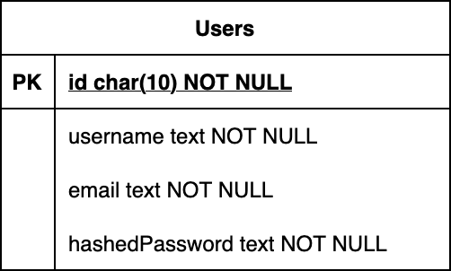
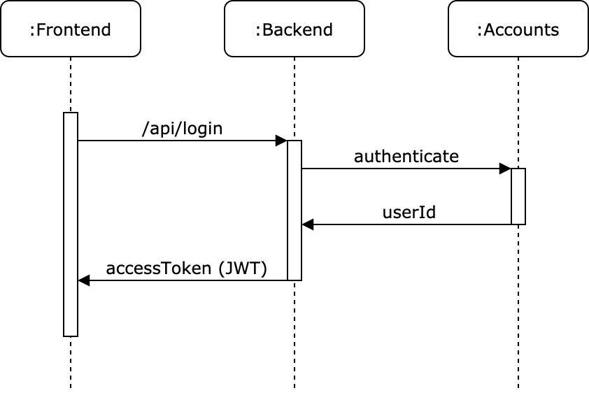

A live deployment of this project can be seen at http://dummy-auth.mohtar.usw1.kubesail.org

# Summary

This project includes the following endpoints:

* /api/signup
* /api/login
* /api/self

Additionally, a React-based frontend is included that showcases the above endpoints.

# Requirements

* Node 14+
* Yarn 12+
* MongoDB 4+
* Docker and Minikube (optional)

# Installation

Make sure MongoDB is running and listening on port 27017, then run the following:

    yarn build && yarn start

A web server will start on port 8080. Visit http://localhost:8080/ on a web browser to see the frontend in action.

# Testing

To run unit tests, run the following:

    yarn test

# Local deployment

Make sure you have Docker install and Minikube running on your local machine, then run the following:

    yarn deploy

To access the deployed containers, run `kubectl port-forward svc/webapp 8080:80` and visit http://localhost:8080/ on a web browser. To terminate, press Ctrl+C.

To clean up, run

    yarn undeploy

# API Documentation

For POST requests, parameters are sent as form URL-encoded format.

Responses are returned as JSON-encoded objects.

## POST /api/signup

Create new user.

Returns 400 if user already exists.

Parameters:

* `username`
* `email`
* `password`

Response:

* `accessToken` (String)
* `expiresIn` (Number)

## POST /api/login

Authenticate an existing user.

Returns 400 if supplied credentials are invalid.

Parameters:

* `usernameOrEmail`: Can be either username or email
* `password`: Password for the user

Response:

* `accessToken` (String): Access token
* `expiresIn` (Number): Access token expiry

## GET /api/self:

Retrieves info for current user.

Returns 401 if access token is invalid or expired.

Headers:

* `Authorization`: Bearer token, in the following format: `Bearer <ACCESS_TOKEN>`

Response:

* `id` (String)
* `username`: (String)
* `email` (String)

# System architecture

How user information is stored:

Sequence diagram illustrating login use case:

